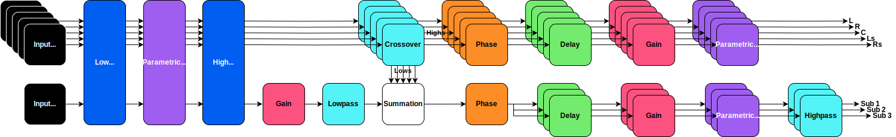
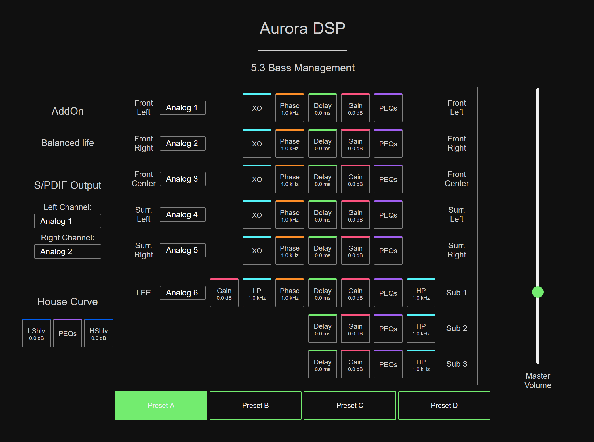
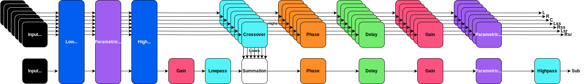
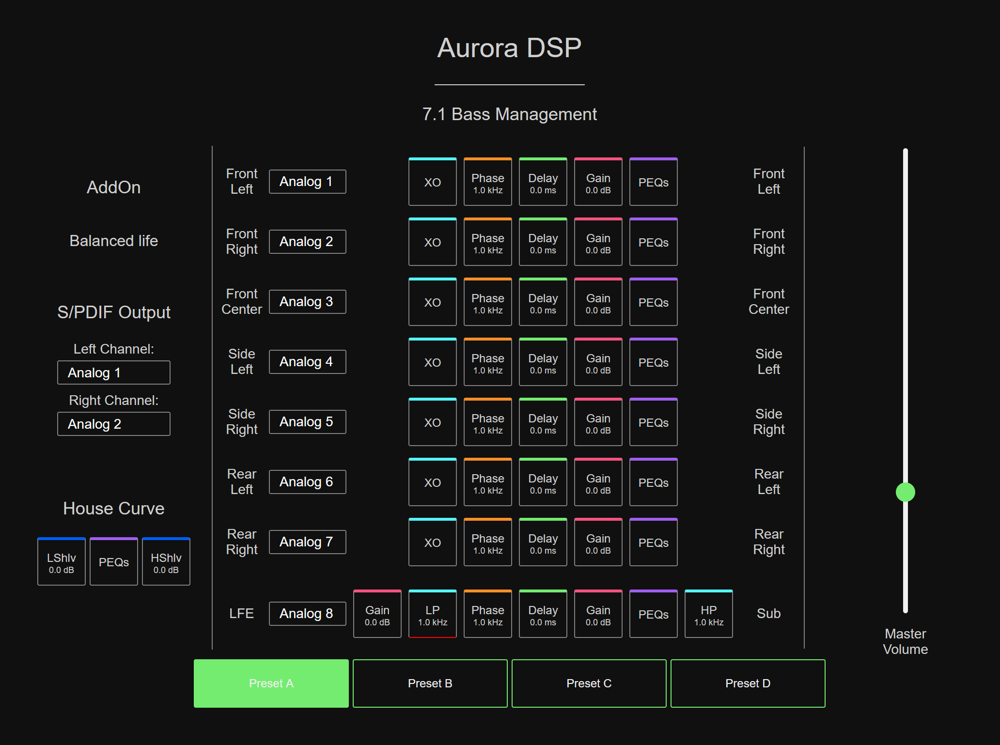

# freeDSP-aurora-bass-managed-surround

Plugins for freeDSP Aurora allowing bass management for 5.3 and 7.1 systems.

## License

[![CC BY-NC-SA 4.0][cc-by-nc-sa-image]][cc-by-nc-sa]

This work is licensed under a [Creative Commons Attribution-NonCommercial-ShareAlike 4.0 International License][cc-by-nc-sa].

[cc-by-nc-sa]: http://creativecommons.org/licenses/by-nc-sa/4.0/
[cc-by-nc-sa-image]: https://licensebuttons.net/l/by-nc-sa/4.0/88x31.png

## DSP programs

### 53BassManagement

### 71BassManagement

## Intended workflow

1. Measure response of all satellites and subs with [REW](https://www.roomeqwizard.com/)
2. Align/EQ subs with [MSO](https://www.andyc.diy-audio-engineering.org/mso/html/) if there is more than
3. Time align impulses on satellites using Delay block
4. Adjust gain of satellites using Gain block
5. Correct modes and interference on satellites up to Schröder frequency (~300 Hz) using EQ block; use REW to calculate EQ settings.
6. Using XOver, Phase and LFE delay blocks, implement the actual bass management; see <https://www.andyc.diy-audio-engineering.org/mso/html/tech-topics/optimizing-the-splice-1.html> and <https://www.andyc.diy-audio-engineering.org/mso/html/tech-topics/optimizing-the-splice-2.html>
7. Implement house curve using target curve EQ
8. Use LFE lowpass to filter out full-range signals from faulty surround music masters (e.g. NIN's The Downward Spiral)
